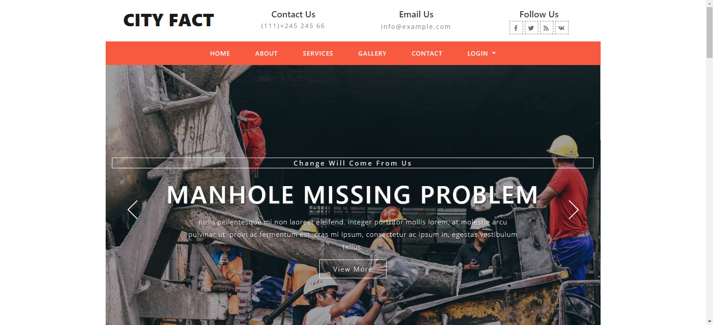

# City Fact/city-problem-solver

   
  
  
  
  
  

## Problem Statement

In Dhaka city we face :
- Garbage problem
- Drainage problem
- Manhole missing problem
- Road damage problem

Authority cannot easily understand those problems and not take the essential steps to solve.

## Goals

- Providing city corporation service without waste of time
- Building a platform where people can easily complain

By this application, authority can understand the problem under the city corporation and take the essential steps to solve the problem.

## Project Overview

- User submit complain
- Admin keep record
- Admin assign worker to complain
- Worker upload work status
- User check work status

## Technologies

- Front end: HTML, CSS, Bootstrap, Font awesome, JavaScript
- Back end: .Net Core MVC
- ORM: Entity Framework Core (Code First)

## About the Author

### Raihan Mahmud

- Facebook Page - [Raihan Mahmud RAM](https://www.facebook.com/raihanmahmudofficial)
- Facebook - [Raihan Mahmud RAM](https://www.facebook.com/raihanM95)
- Twitter - [Raihan Mahmud RAM](https://twitter.com/raihanM95)
- Linkedin - [Raihan Mahmud RAM](https://www.linkedin.com/in/raihanM95)

## Licensing

raihanM95/city-problem-solver Project is licensed with the [Apache License](https://github.com/raihanM95/city-problem-solver/blob/master/LICENSE).
